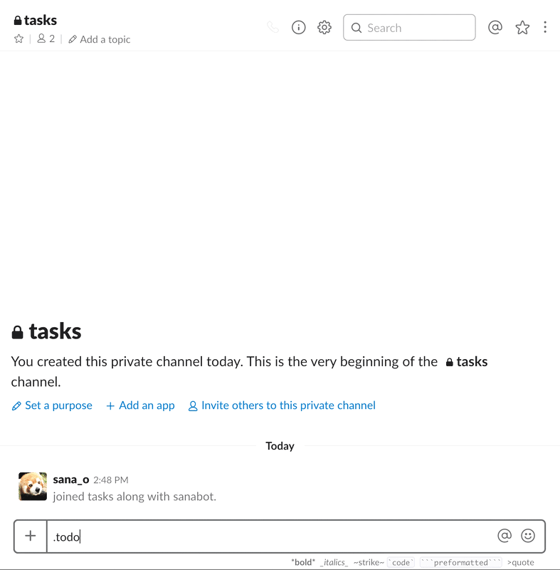
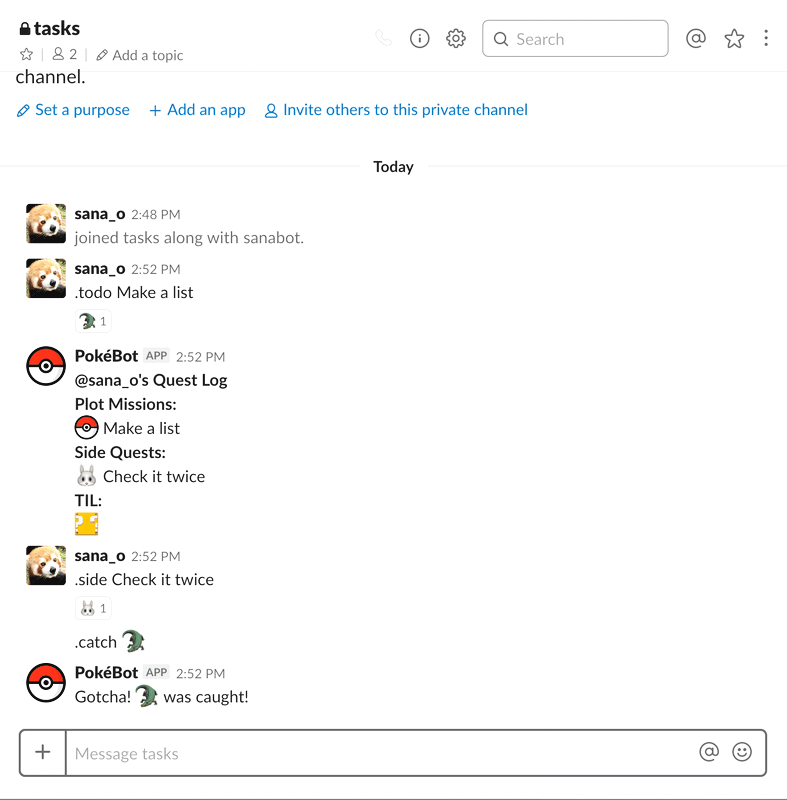

# Pokébot

This is a custom todo list Slackbot I built using Botkit. I've written a  blog post on this experiment on Medium ([I Wanna Be The Very Best!](https://medium.com/@bigshika/i-wanna-be-the-very-best-61b490823679) by @bigshika), which has screenshots and so on.

## Installation Instructions

- Go to https://[yourteamgoeshere].slack.com/apps/manage/custom-integrations and click Bots, then click the green "Add Configuration" button on the left. If you don't see it, you may have to ask your team owner for permissions.

- Fill in all the details it wants for your new bot - only the bot username here is permanent, so the rest of the fields can be placeholders. This will give you a Slack Token.

- Clone or download this repo

- Open `package.json` and edit the line `"start": "SLACK_TOKEN={YOUR TOKEN GOES HERE} node listbot"` - add your Slackbot token here.

- Run `npm start` from inside that folder and you should see the bot connecting to your Slack team.

## Available Commands

- `.help` - displays list of commands available.

- `.list` - initialises a new list, or if one already exists, echoes it into the current channel. 
    - The main source of truth will be the channel you first initialised it in though, so be careful about where you create it. 
    - Each list lasts for a day, and nothing carries over.

- `.todo` - adds a main list item. Initialises a new list in the current channel if one does not exist for today.

- `.side` - adds a sidequest item. Initialises a new list if one does not already exist for today.

- `.til` - adds a new learning item. Initialises a new list if one does not already exist for today.

## Demo

### Making a new list

### Adding a TIL

## Known Issues

- There's currently some strange behaviour around making a new list in a newly created channel.